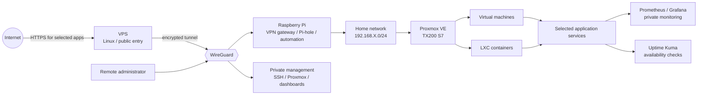

# Homelab Infrastructure

A personal infrastructure project built incrementally around a Fujitsu PRIMERGY TX200 S7 running Proxmox VE. It combines virtualization, a small Linux VPS, WireGuard, a Raspberry Pi gateway, selected reverse proxied services, monitoring, DNS filtering, and automation.

The emphasis here is the engineering work: understanding the path a packet takes, limiting public exposure, and diagnosing failures layer by layer. This is a personal homelab, not a production high availability design. Some components were experiments; details that were not confirmed are described as examples or planned work.

## Architecture



The diagram describes the intended design and the roles explored over time; it is not a claim that every component ran together continuously. Management interfaces are intended to stay on the LAN or VPN. Only selected application endpoints are candidates for public HTTPS access.

## What I Built

- A Proxmox host for experimenting with VMs and LXC containers on existing server hardware.
- A Linux VPS as a stable Internet entry point and WireGuard peer.
- A Raspberry Pi used for gateway, DNS filtering, Wake-on-LAN, and automation experiments.
- Reverse proxy paths from selected public HTTPS endpoints through WireGuard to an application.
- Prometheus, Node Exporter, Grafana, and Uptime Kuma for resource and availability visibility.
- Python examples for Wake-on-LAN and controlled Discord-triggered operations.

## Why I Built It

The project grew from wanting to virtualize older hardware into a practical environment for self-hosting and remote administration. Each new requirement exposed another system boundary: storage layers, routes, firewall families, DNS, TLS, service permissions, and power use. The documentation records those boundaries and how I learned to test them.

## Tech Stack

| Area | Components |
|---|---|
| Virtualization | Proxmox VE, VMs, LXC |
| Compute | Fujitsu PRIMERGY TX200 S7, Linux VPS, Raspberry Pi |
| Networking | TCP/IP, IPv4/IPv6, WireGuard, routing, NAT, DNS |
| Edge | Nginx, Nginx Proxy Manager, TLS |
| Services | Pi-hole, Nextcloud exploration |
| Monitoring | Prometheus, Node Exporter, Grafana, Uptime Kuma |
| Operations | SSH, UFW/iptables, Python, Wake-on-LAN, Discord automation |

## Security Model

The design separates public application access from administration. The VPS can accept HTTPS and terminate or forward selected application traffic. Administrative access uses WireGuard; Proxmox, SSH, monitoring backends, and the Nginx Proxy Manager control plane are not presented as public services. Firewall policy must be validated for IPv4 and IPv6 independently.

## Monitoring and Automation

Prometheus and Grafana cover metrics and resource trends. Uptime Kuma answers a different question: whether a service responds. Raspberry Pi automation experiments include sending a Wake-on-LAN packet and requesting a controlled host action over SSH. Example scripts use placeholders and environment variables; they are not turnkey deployment instructions.

## Problems I Investigated

- A WireGuard handshake can succeed while routed LAN hosts remain unreachable.
- A reverse proxy `502 Bad Gateway` can originate at several points between proxy and backend.
- A service that works locally may be blocked by routing, firewall policy, or interface binding.
- IPv4 restrictions do not prove equivalent IPv6 restrictions.
- Older Raspberry Pi OS repositories returned errors, exposing the maintenance cost of EOL systems.
- Hardware RAID, Linux block devices, and Proxmox storage are distinct layers.
- Always-on server power use led to CPU governor and Wake-on-LAN experiments.

These are documented as investigations; an exact historical root cause is stated only where it is known.

## Key Lessons

1. Verify the backend before changing DNS or proxy settings.
2. A tunnel is only one part of routed connectivity; forwarding, routes, and firewall rules also matter.
3. Compare intended exposure with listening sockets and authorized external observations, over IPv4 and IPv6.
4. Give automation the smallest permissions it needs and keep credentials outside Git.
5. Monitoring availability and monitoring performance are separate jobs.
6. Document the system as it evolves, including experiments and unresolved questions.

## Documentation

- [Architecture](docs/architecture.md) · [Project evolution](docs/project-evolution.md) · [Lessons learned](docs/lessons-learned.md)
- [Proxmox](docs/proxmox.md) · [Networking](docs/networking.md) · [WireGuard](docs/wireguard.md) · [VPS](docs/vps.md) · [Raspberry Pi](docs/raspberry-pi.md)
- [Reverse proxy](docs/reverse-proxy.md) · [Nginx Proxy Manager](docs/nginx-proxy-manager.md) · [DNS](docs/dns.md) · [Pi-hole](docs/pihole.md) · [Nextcloud](docs/nextcloud.md)
- [Monitoring](docs/monitoring.md) · [Automation](docs/automation.md) · [Wake-on-LAN](docs/wake-on-lan.md) · [Energy management](docs/energy-management.md) · [Security](docs/security.md)
- [Troubleshooting index](docs/troubleshooting/README.md)
- [Sanitized configuration examples](configs/)

## Repository Structure

```text
docs/             Architecture, component notes, evolution, and investigations
configs/          Sanitized configuration examples, never live secrets
scripts/          Small illustrative automation examples
diagrams/         Diagram index and supplemental flows
```

## Security Notice

This repository is intended for public viewing. All addresses, domains, keys, and service targets in examples are placeholders. Review every file and Git history before publishing. Adapt and test configurations for your own environment; examples can change network reachability if applied without review. See [SECURITY.md](SECURITY.md).
