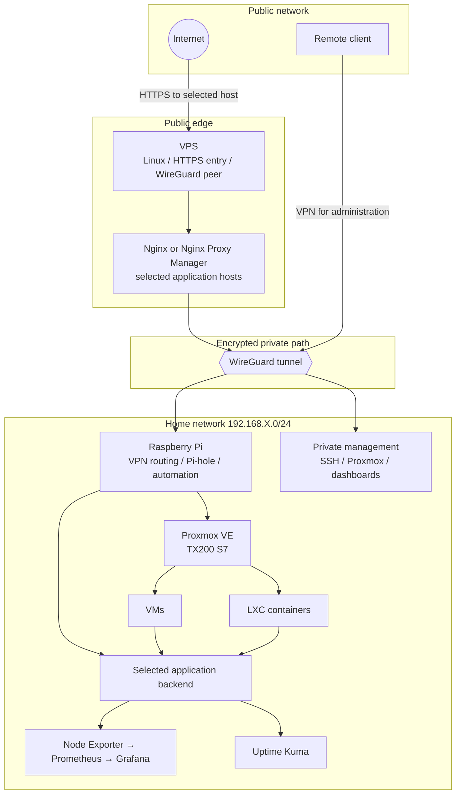
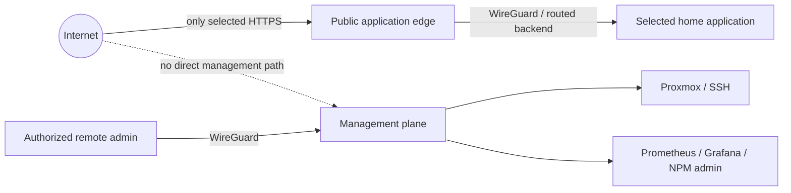
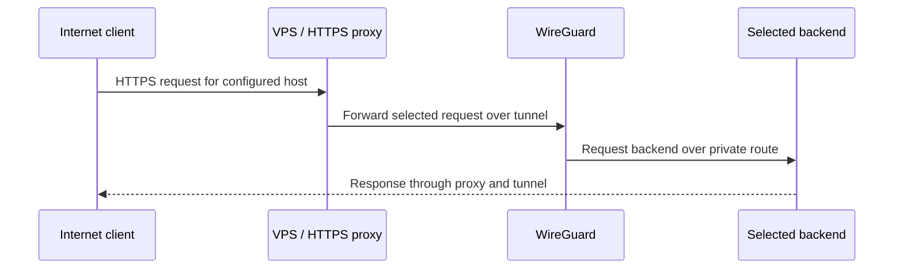
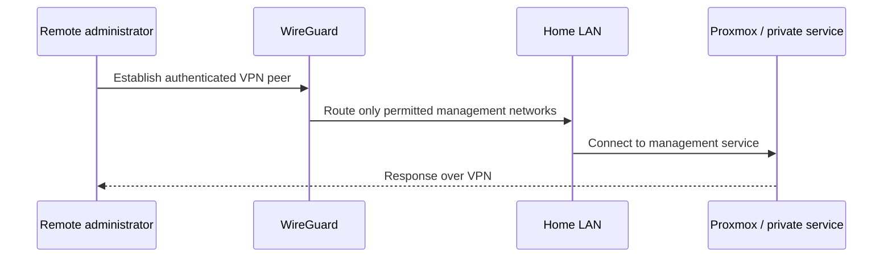

# Architecture

## Current design model

The homelab is documented as a set of roles that were introduced over time. The diagram is a conceptual view, not an uptime or deployment inventory.

## Trust boundaries

The public edge and management plane have different purposes. The reverse proxy is an entry point for selected applications; it does not make administrative interfaces appropriate for public exposure. The actual firewall and route configuration must be checked on each host, including IPv6.

## Request flows

### Public application

### Administration

## Addressing and storage

Public documentation uses `192.168.X.0/24` for an anonymized home network and placeholders for host addresses. Where examples need a public IPv4 address, use RFC 5737 documentation ranges. Storage must be understood in layers: physical SAS disks connect to a hardware RAID controller, which can present logical volumes to Linux; Linux block devices are then used by Proxmox storage definitions and guest disks. The RAID level and exact storage layout have not been verified here.

## Implemented, explored, planned

Proxmox virtualization, remote access experiments, reverse proxying, DNS filtering, monitoring, Wake-on-LAN, and Discord/SSH automation are part of the project history. The exact deployment state changed over time. Do not infer that every component shown above is currently active or that planned improvements have been deployed.
