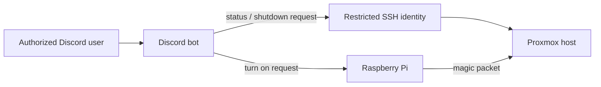

# Automation

Automation experiments used a Raspberry Pi, Python, SSH, Discord commands, and Wake-on-LAN. The Raspberry Pi historically ran Python 3.7.x and discord.py 1.7.x, which constrained dependency versions. Example code in this repository is written for clarity and uses environment variables; it does not claim compatibility with that older runtime.

Use an allowlist of authorized user IDs, validate commands, and avoid exposing arbitrary shell execution. Store the bot token outside source control. SSH keys should have narrow access; if sudo is required, allow only the required executable and arguments. Never grant `NOPASSWD: ALL` for convenience.

The supplied [Discord bot example](../scripts/discord-bot/bot.py) only demonstrates an authorization-gated status response. It deliberately does not implement shutdown or arbitrary command execution. Add privileged operations only with a reviewed, command-specific design.
