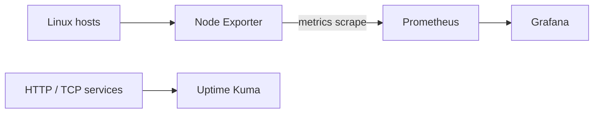

# Monitoring

Monitoring developed in two complementary directions: resource metrics and availability checks.

Node Exporter exposes host metrics, Prometheus collects time series, and Grafana presents dashboards. Uptime Kuma checks whether services respond. A service can be available while resource pressure is high, or metrics can be healthy while a particular application endpoint is down.

Common default ports include Prometheus 9090, Node Exporter 9100, and Proxmox UI 8006. These are documentation examples; monitoring backends and management interfaces should remain private/VPN-only unless there is a reviewed reason otherwise.

To investigate an unreachable target, verify the process and listening socket, then test from the Prometheus host, inspect route/firewall policy, and compare the configured scrape target with the actual address. Avoid publishing dashboards that reveal internal hostnames or topology.
