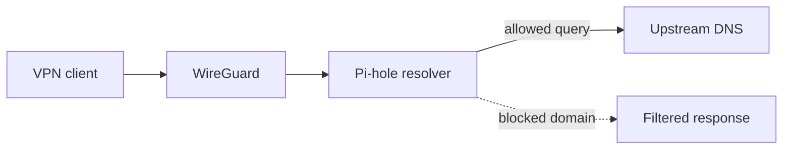

# Pi-hole

Pi-hole was introduced for DNS filtering and local name resolution, including use by VPN clients.

The VPN client must receive a reachable DNS server address and have a route/firewall path to it. Test name resolution from the client, then query Pi-hole directly to isolate resolver configuration from tunnel routing.

DNS filtering is not a universal ad blocker. Ads served from the same domains or infrastructure as application content are difficult to block without breaking that content. Filtering also depends on clients actually using the configured resolver; applications may use their own encrypted DNS.

Keep the administrative interface private, and do not publish query logs or client names in public documentation.
