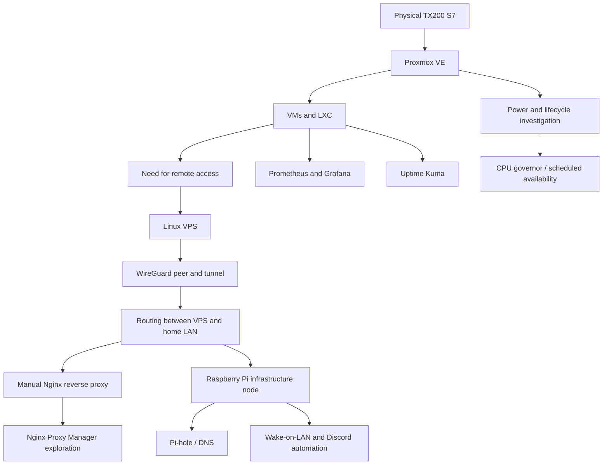

# Project evolution

The system grew by adding capabilities when a concrete need appeared. The sequence below captures the direction of that work; some components were experiments and were not necessarily active together.

Each addition also created a new failure domain. A reverse proxy required a working backend route, correct protocol, and DNS. VPN access required more than a handshake: route selection, kernel forwarding, and firewall policy all had to agree. Monitoring then made resource use and availability easier to observe.

The chronology is a learning narrative, not a claim that every stage was a formal production deployment. Future improvements should be labeled as planned until verified.
