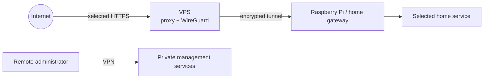

# VPS

A small Linux VPS was added as a stable, publicly reachable entry point. It can host a WireGuard peer and reverse proxy selected application traffic toward the home network. Observed memory was around 826 MiB, which encouraged keeping the public edge lightweight.

This pattern reduces the need to publish multiple home services directly. It introduces dependencies on VPS availability, tunnel routes, and reverse proxy configuration. The VPS is not a substitute for patching or firewalling the home side.

Keep SSH access restricted to trusted paths, expose only necessary listeners, monitor disk/memory use, and account for the VPS as a separate security boundary. Do not publish its real address or provider identifiers.
