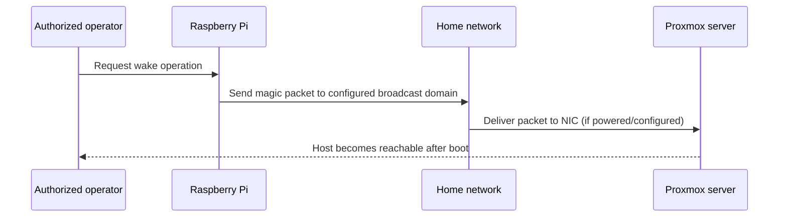

# Wake-on-LAN

Wake-on-LAN was used or explored as a way to bring the Proxmox host online when needed, reducing the time the server must run continuously.

Wake-on-LAN depends on NIC and BIOS/UEFI support, the system's power state, link state, and whether the magic packet crosses the network path. Routers commonly do not forward broadcast packets across subnets. Validate the target MAC locally and keep it out of public documentation.

The example [wol.py](../scripts/wake-on-lan/wol.py) requires an environment-provided MAC and broadcast address. It validates input and reports errors. This script sends a packet; it does not confirm that the server booted. Verify afterward with an authorized service check.
